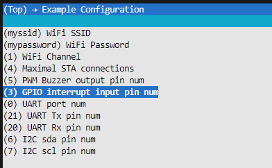

| Supported Targets | ESP32 | ESP32-C2 | ESP32-C3 | ESP32-S2 | ESP32-S3 |
| ----------------- | ----- | -------- | -------- | -------- | -------- |

# Wi-Fi SoftAP tcp server Example

This example shows how to use the Wi-Fi SoftAP functionality of the Wi-Fi driver of ESP for serving as an Access Point. 
And tcp_server feature is running with myssid@mypassword, ap ip is 192.168.x.1 
Actual IP address can be seen via console log 

## How to use example

Connect to myssid@mypassword 
send data via tcp_client 
You can see data received via console 

### How to use cli command
You need connected tcp_client 
In code, refer cli_command.c/h 
You can get all the informations via "?" 
ESP platform has an issue when user use gets API so cliTask cannot use here. 
Instead of cliTask, calls cliLineParser to parse messages from wifi network. 

### Configure the project

Open the project configuration menu (`idf.py menuconfig`).

In the `Example Configuration` menu:

* Set the Wi-Fi configuration.
    * Set `WiFi SSID`.
    * Set `WiFi Password`.
* Set peripheral port number according to your ESP32 chip
    * ESP_PWM_BUZZER_PIN
      * C3 : 5
    * ESP_GPIO_IN_INT_PIN
      * C3 : 3
    * ESP_UART_NUM
      * C3 : 0
    * ESP_UART_TXD_PIN
      * C3 : 21
    * ESP_UART_RXD_PIN
      * C3 : 20
    * ESP_I2C_SDA_PIN
      * C3 : 6
    * ESP_I2C_SCL_PIN
      * C3 : 7

Optional: If you need, change the other options according to your requirements.

## Feature
- tcp_server
  - tcp_server_task
    - receive/send data to/from client
    - need to implement handler in do_retransmit()
- periodic task
  - periodic_task() is running periodically
  - implement what you need here
- RTC PCF8563
  - Xiao expansion board includes RTC, PCF8563
  - driver for RTC
- uart_rx
  - uart receive thread
  - implement uart data handler in uart_event_task()
  - you can send data via uart, bsp_uart_send()
- oled display
  - lcd driver : ssd1306, 128x64 0.96"
  - reference code from https://github.com/nopnop2002/esp-idf-ssd1306/tree/master
- gpio interrupt
- buzzer
- user config menuconfig example configuration 

 
- BEL features
  - BLE spp server feature added
    - connect to "nimble-ble-spp-svr"
    - Could connect via phone@nordic_connect
    - Could communicate between kit and phone
  - BLE user temp characteristics added
  - BLE battery service added

## Build and Flash

cd /home/louiey/esp/esp-idf  
source ./export.sh

// go to project folder  
cd /home/louiey/Work/ESP32C3/xiao_esp32c3_ap_tcp_server  
idf.py set-target esp32c3  
idf.py menuconfig  
idf.py build  
idfx flash COM5  
idf.py -p ttyACM0 flash 

See the Getting Started Guide for all the steps to configure and use the ESP-IDF to build projects.

* [ESP-IDF Getting Started Guide on ESP32](https://docs.espressif.com/projects/esp-idf/en/latest/esp32/get-started/index.html)
* [ESP-IDF Getting Started Guide on ESP32-S2](https://docs.espressif.com/projects/esp-idf/en/latest/esp32s2/get-started/index.html)
* [ESP-IDF Getting Started Guide on ESP32-C3](https://docs.espressif.com/projects/esp-idf/en/latest/esp32c3/get-started/index.html)

## Troubleshooting

Whenever client connected at first time, it disconnected soon. Not sure why... 
After reconnect, usually I see working with normal 
Will update when I fix/find root cause. 
