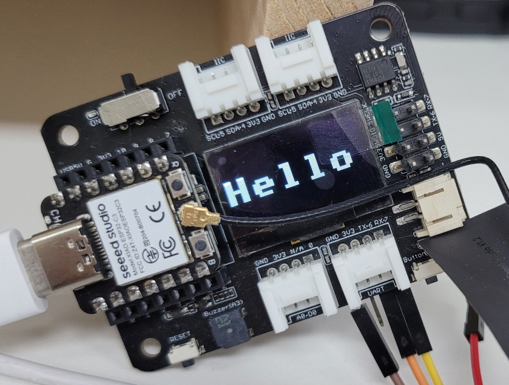

| Supported Targets | ESP32 | ESP32-C2 | ESP32-C3 | ESP32-S2 | ESP32-S3 |
| ----------------- | ----- | -------- | -------- | -------- | -------- |

# Wi-Fi SoftAP tcp server Example

This example shows how to use the Wi-Fi SoftAP functionality of the Wi-Fi driver of ESP for serving as an Access Point.
And tcp_server feature is running with myssid@mypassword, ap ip is 192.168.4.1

## How to use example

Connect to myssid@mypassword 
send data via tcp_client 
You can see data received 

## Feature
- tcp_server
  - tcp_server_task
    - receive/send data to/from client
    - need to implement handler in do_retransmit()
- periodic task
  - periodic_task() is running periodically
  - implement what you need here
- RTC PCF8563
  - Xiao expansion board includes RTC, PCF8563
  - driver for RTC
- uart_rx
  - uart receive thread
  - implement uart data handler in uart_event_task()
  - you can send data via uart, bsp_uart_send()

### Build and Flash

cd /home/louiey/esp/esp-idf  
source ./export.sh

// go to project folder  
cd /home/louiey/Work/ESP32C3/xiao_esp32c3_ap_tcp_server  
idf.py set-target esp32c3  
idf.py menuconfig  
idf.py build  
idfx flash COM5  

See the Getting Started Guide for all the steps to configure and use the ESP-IDF to build projects.

* [ESP-IDF Getting Started Guide on ESP32](https://docs.espressif.com/projects/esp-idf/en/latest/esp32/get-started/index.html)
* [ESP-IDF Getting Started Guide on ESP32-S2](https://docs.espressif.com/projects/esp-idf/en/latest/esp32s2/get-started/index.html)
* [ESP-IDF Getting Started Guide on ESP32-C3](https://docs.espressif.com/projects/esp-idf/en/latest/esp32c3/get-started/index.html)

## Troubleshooting

Whenever client connected at first time, it disconnected soon. Not sure why... 
After reconnect, usually I see working with normal 
Will update when I fix/find root cause. 
